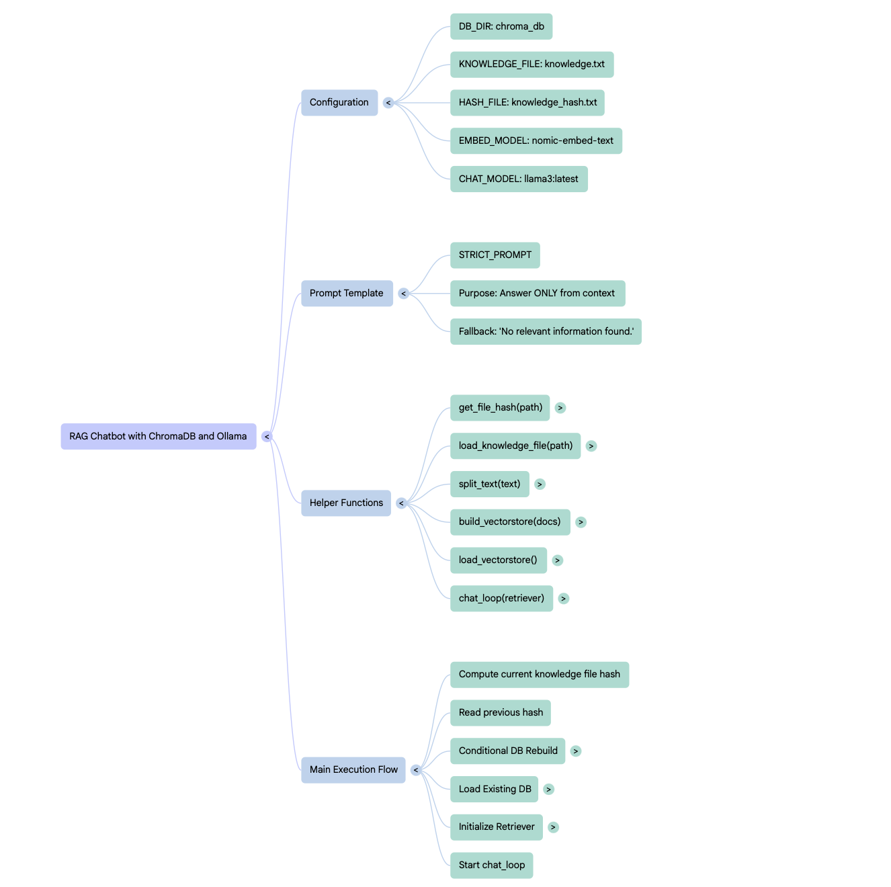

# RAG Chatbot with LangChain, ChromaDB, and Ollama

This project implements a Retrieval-Augmented Generation (RAG) chatbot that:

- Loads a knowledge base (`knowledge.txt`),
- Splits it into chunks,
- Embeds chunks using Ollama embeddings,
- Stores embeddings in Chroma vector database,
- Performs similarity search for questions,
- Uses Ollama LLaMA-based chat model to generate answers based only on retrieved context,
- Falls back to general LLaMA chat if no relevant info found.

---

## Table of Contents

- [Features](#features)  
- [Prerequisites](#prerequisites)  
- [Setup and Installation](#setup-and-installation)  
- [Usage](#usage)  
- [How to add knowledge](#how-to-add-knowledge)  
- [Code Explanation & Flow](#code-explanation--flow)  
- [Mindmap / Flowchart](#mindmap--flowchart)  
- [Troubleshooting](#troubleshooting)  

---

## Features

- Incremental knowledge ingestion with content hashing to avoid rebuilding unnecessarily.
- Chunking of large texts with overlap for better semantic search.
- Embedding generation via Ollama embeddings.
- Persistence of vector store with ChromaDB.
- RetrievalQA chain with strict prompt limiting answers to context.
- Graceful fallback to chat model for out-of-context queries.
- Simple CLI interactive chat loop.

---

## Prerequisites

- Python 3.8+
- [Ollama CLI](https://ollama.com/docs/install) installed and set up on your machine.
- Ollama models installed locally (like `llama3:latest`).
- Basic familiarity with Python and command line.

---

## Setup and Installation

### 1. Clone or copy the project files

Ensure you have:

- `knowledge.txt` — Your knowledge base text file.
- `rag_chat.py` — The main Python script.
- `requirements.txt` — Dependencies file.

---

### 2. Install Python dependencies

Create a virtual environment (optional but recommended):

```bash
python3 -m venv venv
source venv/bin/activate   # On Windows: venv\Scripts\activate

Install dependencies:
pip install -r requirements.txt
 ```

### 3. Install and configure Ollama

```bash
ollama list
ollama pull llama3:latest
 ```
---

### 5. Prepare knowledge

Add your RAG knowledge to knowledge.txt

---

### 4. Usage
```bash
python rag_chat.py
```